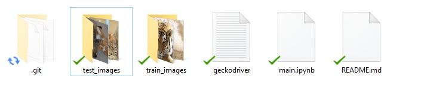

# Actividad Integradora #2
##### Esta actividad contiene un raspador web que extrae imágenes específicas de la base de datos [ImageNet](http://www.image-net.org/), en base a un término de busqueda ingresado por el usuario. Divide las imágenes descargadas en dos carpetas. El 80% de las imágenes se guardan en una carpeta de entrenamiento y un 20% en una carpeta de pruebas. 

Utilizando el entorno de pruebas Selenium en conjunto con las librerías NumPy, OpenCV y sci-kit image, el programa abre una pestaña de Chrome utilizando Selenium y Chromedriver, introduciendo en la barra de búsqueda del sitio principal el termino específicado por el usuario. Tras realizar la busqueda, el programa extrae los URLs correspondientes guardándolos en una lista. A partir de la lista de URLs, se realiza la división de los datos en un set de entrenamiento (80% de los resultados) y de pruebas (20% de los resultados). En base a estas listas, se guardan los resultados obtenidos en su carpeta correspondiente, guardando las imágenes con ayuda de sci-kit image. 

El código en el jupyter notebook, muestra los URLs minados, así como aquellos que son descargados. 

Consideramos en base al programa y su presentación que presentaría un buen punto de partida para aquellos interesados en desarrollar un web scraper de imágenes, partícularmente en el ámbito de inteligencia artificial.

##### Representación y fuente de datos. 
Las imágenes utilizadas son extraídas de la base de datos [ImageNet](http://www.image-net.org/) utilizando la herramienta [Selenium](https://selenium-python.readthedocs.io/).

##### Dependencias 
1. Selenium
2. OpenCV
3. Numpy
4. Sci-kit image (en partícular el módulo io)

##### Algoritmo
1. Ver la página de busqueda de image-net.org

```
driver.get("http://image-net.org/index")
```
2. Selecionar el temino a buscar

```
elem.send_keys("cat")
elem.send_keys(Keys.RETURN)
```
3. Encontrar los URLS, resultados de la busqueda

```
URLss = driver.find_element_by_tag_name('pre')
```
4. Dividir los URLS en testing y training

```
dividir = int(len(URLs)*0.80)
URL_train = URLs[0:dividir]
URL_test = URLs[dividir:-1]
```
5. Descargar las imagenes, normbradas con índices, en la carpetas selecionadas

```
for url in URL_train:
    name = carpeta + 'cat_train' + str(it) + '.jpg'
    image = io.imread(url)
    image1 = cv2.cvtColor(image, cv2.COLOR_BGR2RGB)
    cv2.imwrite(name,image1)
    cv2.waitKey(0)
    it= it + 1
```
##### Las imagenes son distribuidas en sus respectivas carpetas de test_images y train_images.

 
##### Contribuidores
* [GustavoDLRA](https://github.com/GustavoDLRA)
* [hugoyervides](https://github.com/hugoyervides)
* Astrid
* [olefran](https://github.com/olefran)
* [Felipe](https://github.com/Felipev201)

En caso de estar interesado en una introducción al uso de Selenium, adjuntamos el siguiente tutorial:
- [Selenium with Python](https://selenium-python.readthedocs.io/)
- [Introducción a Selenium](https://www.youtube.com/watch?v=mOAXEQevCAE&ab_channel=AutomationStepbyStep-RaghavPal)
- [Descarga de Chromedriver para pruebas en Chrome](https://www.youtube.com/watch?v=dz59GsdvUF8&ab_channel=ArturSpirin)
- [Descarga de imágenes vía URL](https://www.pyimagesearch.com/2015/03/02/convert-url-to-image-with-python-and-opencv/)

Para aprovechar al máximo este repositorio y poder editarlo al momento de descargarlo se recomienda el uso de Jupyter Notebook mediante Anaconda: 
1. Instalar [Anaconda](https://www.anaconda.com/products/individual)
2. Abrir Jupyter Notebook
